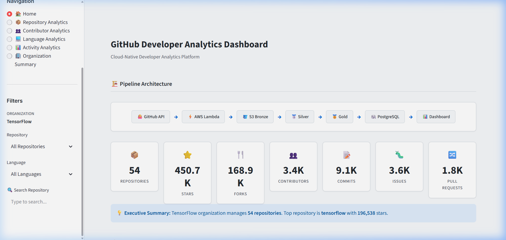
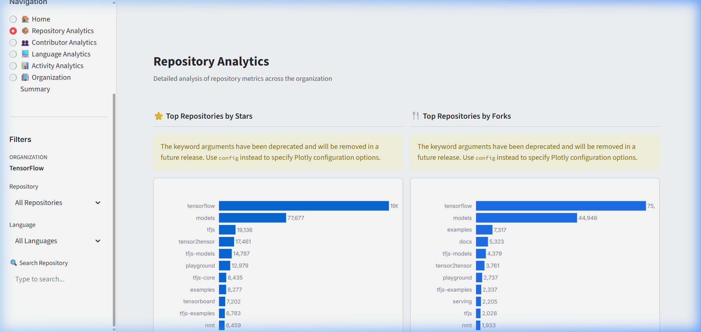
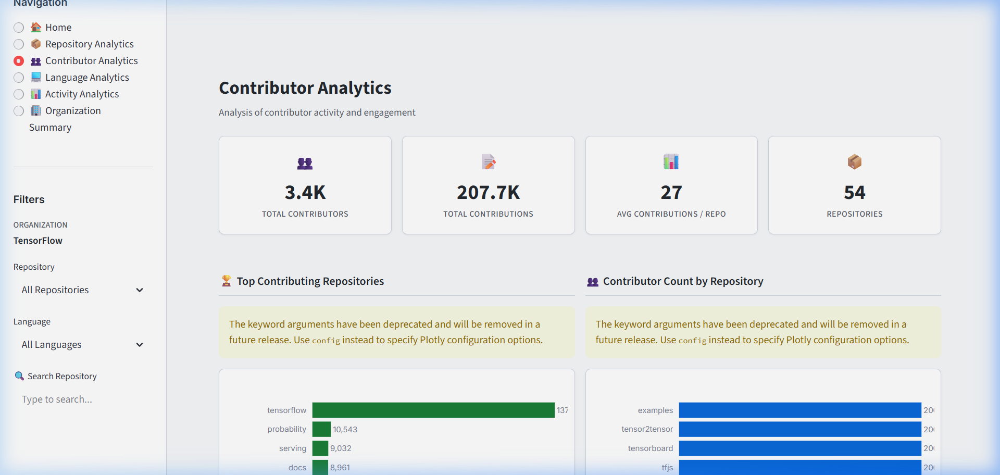
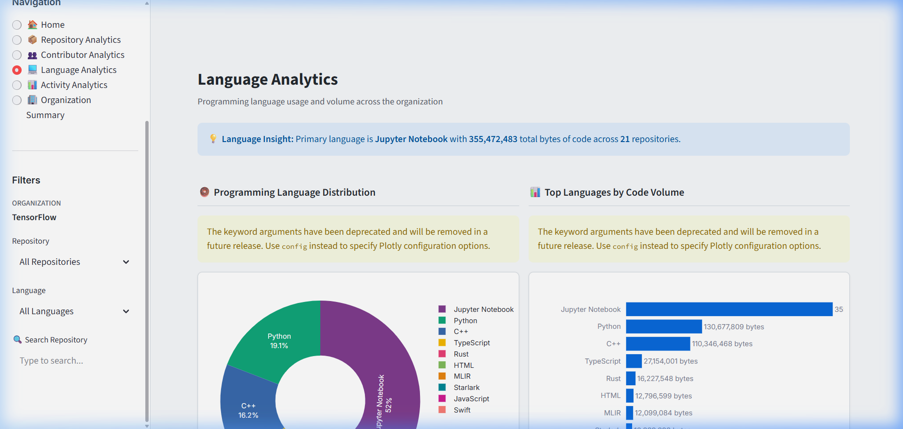
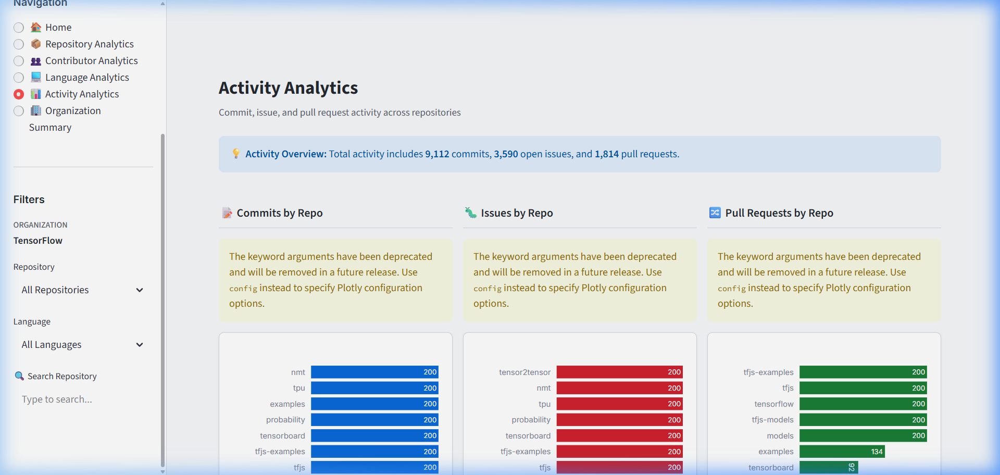
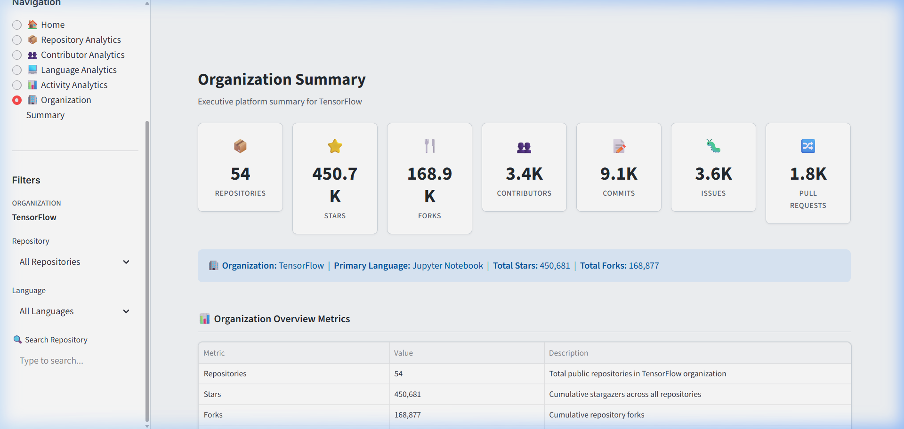

<p align="center">
  <h1 align="center">⚡ Cloud-Native Developer Analytics Platform</h1>
  <p align="center">
    <strong>An end-to-end Data Engineering pipeline & BI dashboard powering organization-wide GitHub developer telemetry insights.</strong>
  </p>
</p>

<p align="center">
  
  
  
  
  
  
  
</p>

---

## 📌 Table of Contents

- [Overview](#-overview)
- [System Architecture](#-system-architecture)
- [Medallion Data Lake Design](#-medallion-data-lake-design)
- [Interactive Streamlit Dashboard](#-interactive-streamlit-dashboard)
- [Technology Stack](#-technology-stack)
- [Project Directory Structure](#-project-directory-structure)
- [Data Quality & Lineage](#-data-quality--lineage)
- [How to Run](#-how-to-run)
- [License & Contact](#-license--contact)

---

## 🚀 Overview

Engineering leaders managing large GitHub organizations (such as `tensorflow`) often struggle to gain centralized visibility into repository growth, code volume distribution, contributor engagement, and issue backlog velocity.

This platform provides an automated, serverless data pipeline and an interactive executive BI dashboard that extracts, standardizes, models, and visualizes GitHub telemetry.

### Key Capabilities
* **Serverless Ingestion**: Extracts repository metadata, language bytes, commit histories, contributor metrics, open issues, and pull requests via GitHub REST API.
* **Medallion Data Lake Architecture**: Organizes storage into Bronze (raw ingestion), Silver (cleaned/standardized schemas), and Gold (aggregated business metrics) partitions in Apache Parquet format.
* **Relational Serving Layer**: Automates loading of Gold analytical models into PostgreSQL via SQLAlchemy.
* **Executive BI Dashboard**: A 6-page interactive Streamlit dashboard featuring Plotly visualizations, custom GitHub-inspired styling, and cached database queries (`@st.cache_data`).

---

## 🏗️ System Architecture

```
                                 DATA PIPELINE ARCHITECTURE

  ┌─────────────────┐        ┌─────────────────┐        ┌─────────────────┐
  │   GitHub API    │ ────>  │   AWS Lambda    │ ────>  │ S3 Bronze Layer │
  │ (REST Endpoints)│        │  (Ingestion)    │        │  (Raw Ingest)   │
  └─────────────────┘        └─────────────────┘        └────────┬────────┘
                                                                 │
  ┌─────────────────┐        ┌─────────────────┐                 │
  │ Streamlit App   │        │ PostgreSQL DB   │                 ▼
  │ (6 Page Views)  │        │ (Serving Layer) │        ┌─────────────────┐
  └────────▲────────┘        └────────▲────────┘        │ S3 Silver Layer │
           │                          │                 │ (Standardized)  │
           └──────────────────────────┴───────────────  └────────┬────────┘
                                    SQLAlchemy                    │
                                (Cached Queries)                 ▼
                                                        ┌─────────────────┐
                                                        │  S3 Gold Layer  │
                                                        │  (Aggregated)   │
                                                        └─────────────────┘
```

### Data Pipeline Stages
1. **Extraction (Bronze)**: AWS Lambda fetches raw telemetry from GitHub API endpoints and writes partitioned Parquet files.
2. **Standardization (Silver)**: Cleans data types, standardizes timestamps, handles missing fields, and enforces schema contracts.
3. **Aggregation (Gold)**: Aggregates repository stats, language code volumes, contributor rankings, and activity metrics into Gold Parquet partitions.
4. **Database Ingestion**: `PostgresLoader` loads Gold analytics datasets into PostgreSQL.
5. **Dashboard Presentation**: Streamlit queries PostgreSQL using SQLAlchemy to render 6 analytical views.

---

## 🥇 Medallion Data Lake Design

| Storage Layer | Data Format | Partition Path | Purpose |
|---|---|---|---|
| **Bronze Layer** | Apache Parquet | `data/bronze/organization={org}/dataset={name}/` | Raw API response preservation |
| **Silver Layer** | Apache Parquet | `data/silver/organization={org}/dataset={name}/` | Schema enforcement, datetime casting, null handling |
| **Gold Layer** | Apache Parquet | `data/gold/organization={org}/dataset={name}/` | Business aggregation models ready for analytical serving |
| **PostgreSQL** | Relational SQL | `developer_analytics` database | Queryable serving layer powering the web application |

---

## 📊 Interactive Streamlit Dashboard

The platform includes a modern 6-page BI dashboard built with Streamlit, Plotly, and custom GitHub-inspired CSS (`#f6f8fa` clean light theme, rounded cards, soft box-shadows).

### 1. 🏠 Executive Overview
Presents a pipeline architecture diagram, 7 high-level KPI cards (Repositories, Stars, Forks, Contributors, Commits, Issues, PRs), top repositories by stars/forks, language breakdown, top contributors, and activity breakdown.



---

### 2. 📦 Repository Analytics
Features top repository bar charts, Watchers vs. Stars scatter plot (sized by forks, colored by language), repository size analysis, and a searchable repository statistics table.



---

### 3. 👥 Contributor Analytics
Displays top contributing repositories, contributor count breakdown, contributions distribution histogram, and a ranked contributor leaderboard.



---

### 4. 💻 Language Analytics
Highlights language distribution donut chart, code volume by language bar chart, and language statistics table with percentage code volume badges.



---

### 5. 📊 Activity Analytics
Provides side-by-side Commit, Open Issue, and Pull Request bar charts per repository along with a factual activity table.



---

### 6. 🏢 Organization Summary
Presents organization-wide summary KPI cards and a platform overview table detailing repositories, stars, forks, contributors, commits, issues, and pull requests.



---

## 🛠️ Technology Stack

| Category | Technology |
|---|---|
| **Core Language** | Python 3.9+ |
| **Cloud Infrastructure** | AWS Lambda, Amazon S3 |
| **Data Engineering** | Pandas, PyArrow, NumPy |
| **Database & Serving** | PostgreSQL, SQLAlchemy, `psycopg2-binary` |
| **BI & Analytics** | Streamlit, Plotly Express |
| **Configuration** | PyYAML, `python-dotenv` |
| **Testing & CI/CD** | Pytest, GitHub Actions |

---

## 📁 Project Directory Structure

```
Cloud-Native-Developer-Analytics-Pipeline/
├── config/
│   └── config.yaml             # Pipeline & PostgreSQL configuration
├── dashboard/
│   ├── app.py                  # Streamlit main entry point
│   ├── database.py             # SQLAlchemy database queries & caching
│   ├── assets/
│   │   └── style.css           # GitHub-inspired clean theme CSS
│   ├── components/
│   │   ├── sidebar.py          # Logo branding, page routing & sidebar filters
│   │   ├── kpi_cards.py        # Reusable metric card renderer
│   │   └── footer.py           # Dashboard footer component
│   └── views/
│       ├── home.py             # Page 1: Executive Overview
│       ├── repository.py       # Page 2: Repository Analytics
│       ├── contributor.py      # Page 3: Contributor Analytics
│       ├── language.py         # Page 4: Language Analytics
│       ├── activity.py         # Page 5: Activity Analytics
│       └── organization.py     # Page 6: Organization Summary
├── data/                       # Local S3 Data Lake emulation
│   ├── bronze/                 # Raw ingestion layer
│   ├── silver/                 # Standardized layer
│   └── gold/                   # Aggregated metrics layer
├── docs/
│   ├── deployment/             # Deployment guides (Streamlit Cloud, Docker)
│   ├── diagrams/               # Architecture sequence flow docs
│   └── images/                 # High-resolution dashboard screenshots
├── lambda/
│   └── lambda_function.py      # Serverless extraction handler
├── src/
│   ├── core/                   # Config loader, logger, constants
│   ├── dq/                     # Data quality rules & validators
│   ├── extract/                # GitHub API client & handlers
│   ├── pipeline/               # Bronze, Silver, Gold pipeline orchestrators
│   ├── serving/                # PostgreSQL writer & loader modules
│   └── storage/                # Parquet & S3 readers/writers
├── test/                       # Pytest unit & integration test suite
├── .env.example                # Environment variable template
├── main.py                     # CLI pipeline orchestrator
└── requirements.txt            # Unified project dependencies
```

---

## ✅ Data Quality & Lineage

The platform enforces data validation and audit logging across all layers:
- **Schema Contracts**: Standardizes field names and datetimes during Silver transformations.
- **Data Quality Validator (`dq/`)**: Executes Gold layer validation rules ensuring metric integrity before PostgreSQL loading.
- **Lineage Metadata (`MetadataWriter`)**: Audits execution timestamps, output file paths, row counts, and status for operational observability.
- **Automated Test Suite**: Verified via `pytest` with 100% pass rate across configuration, extraction, quality rules, and transformation modules.

---

## ⚙️ How to Run

### 1. Prerequisites
- Python 3.9+
- PostgreSQL database running locally or on AWS RDS
- GitHub Personal Access Token

### 2. Installation & Setup
```bash
# Clone the repository
git clone https://github.com/dhruv-limbasiya/Cloud-Native-Developer-Analytics-Pipeline.git
cd Cloud-Native-Developer-Analytics-Pipeline

# Create and activate virtual environment
python -m venv venv
source venv/bin/activate  # On Windows: venv\Scripts\activate

# Install dependencies
pip install -r requirements.txt
```

### 3. Environment Variables
Create a `.env` file in the root directory:
```ini
GITHUB_TOKEN=your_personal_access_token
POSTGRES_PASSWORD=your_postgres_password
POSTGRES_HOST=localhost
POSTGRES_PORT=5432
POSTGRES_DB=developer_analytics
POSTGRES_USER=postgres
```

### 4. Run Pipeline Execution
```bash
# Executes Bronze -> Silver -> Gold -> PostgreSQL loading
python main.py
```

### 5. Launch Dashboard
```bash
# Launch the interactive 6-page Streamlit dashboard
streamlit run dashboard/app.py
```
Access the application in your browser at `http://localhost:8501`.

---

## 📜 License & Author

**Author**: Dhruv Limbasiya  
**Repository**: [Cloud-Native Developer Analytics Platform](https://github.com/dhruv-limbasiya/Cloud-Native-Developer-Analytics-Pipeline)  
Distributed under the MIT License.
