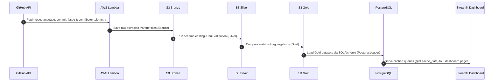

# Cloud-Native Developer Analytics Platform — Architecture Diagrams

This directory contains visual architecture diagrams and sequence flows for the platform.

---

## 1. High-Level Architecture Flow

```
  ┌─────────────────┐
  │   GitHub API    │  (Telemetry Extraction)
  └────────┬────────┘
           │
           ▼
  ┌─────────────────┐
  │   AWS Lambda    │  (Serverless Ingestion Engine)
  └────────┬────────┘
           │
           ▼
  ┌─────────────────┐
  │ S3 Bronze Layer │  (Raw JSON / Parquet Data Lake)
  └────────┬────────┘
           │
           ▼
  ┌─────────────────┐
  │ S3 Silver Layer │  (Standardized & Cleaned Schemas)
  └────────┬────────┘
           │
           ▼
  ┌─────────────────┐
  │  S3 Gold Layer  │  (Aggregated Business Metrics)
  └────────┬────────┘
           │
           ▼
  ┌─────────────────┐
  │   PostgreSQL    │  (Relational Serving Database)
  └────────┬────────┘
           │
           ▼
  ┌─────────────────┐
  │    Streamlit    │  (6-Page Interactive BI Dashboard)
  └─────────────────┘
```

---

## 2. Medallion Pipeline Sequence Diagram


